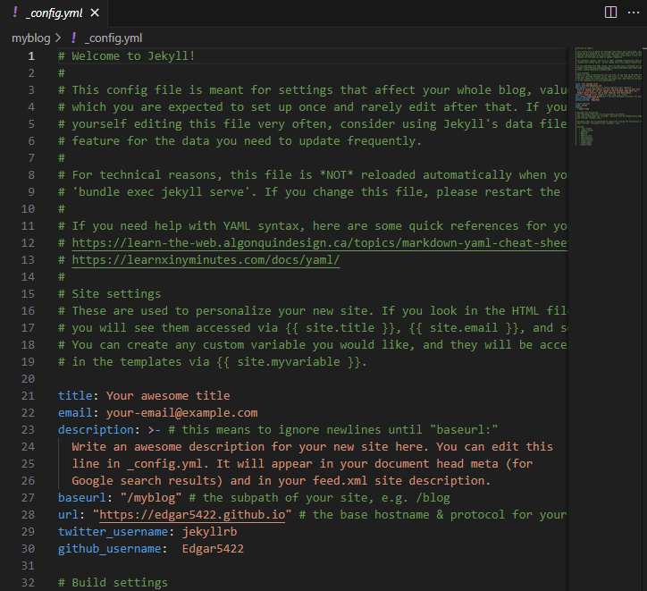
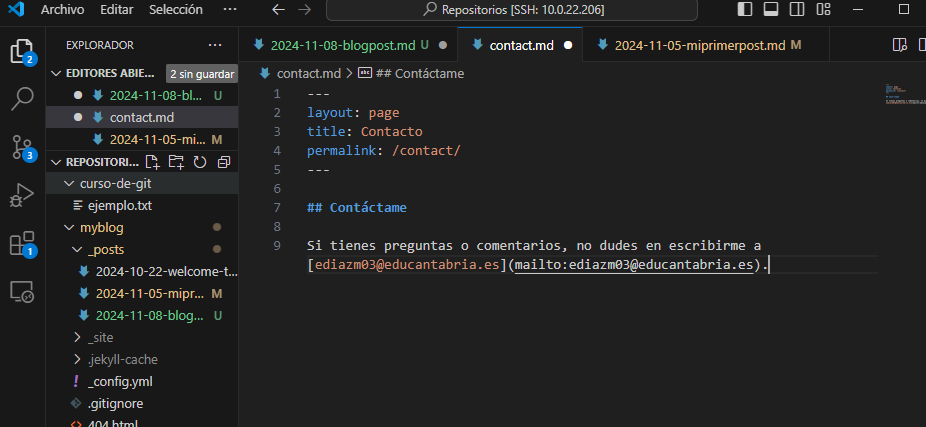
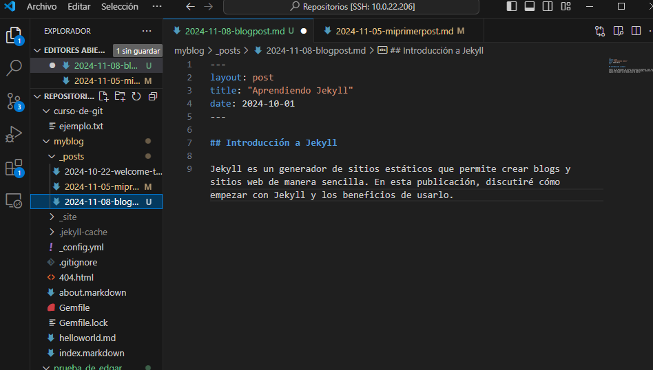
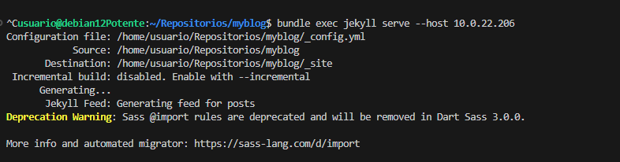
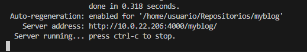
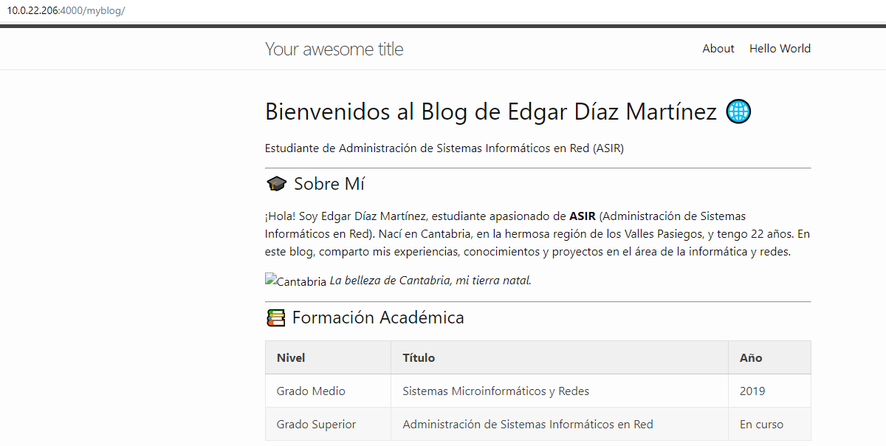

# Ejercicio 1: Despliegue del tema "minima" de Jekyll en GitHub Pages

## Introducción
En este ejercicio, aprenderemos a desplegar un sitio web utilizando Jekyll y el tema "minima" en GitHub Pages. Este proceso incluirá la instalación de Jekyll, la configuración del tema, la creación de contenido y la publicación en GitHub Pages.

---

## Pasos para desplegar Jekyll "minima"

### 1. Instalación de Jekyll

Para comenzar, necesitamos instalar Jekyll en nuestro entorno local. Asegúrate de tener Ruby y Bundler instalados. Luego, ejecuta los siguientes comandos en tu terminal:

```bash
gem install --user-install bundler jekyll
```

### 2. Crear un nuevo sitio Jekyll
Crea un nuevo sitio Jekyll utilizando el tema "minima":

```bash
jekyll new myblog --force
cd myblog
```
### 3. Configuración del archivo _config.yml
Abre el archivo _config.yml y edítalo para agregar tus datos. Aquí hay un ejemplo de cómo debería verse:

```bash
title: Mi Blog Personal
description: Un blog sobre tecnología y desarrollo web.
author:
  name: Edgar Díaz Martínez
  email: ediazm03@educantabria.es
```



### 4. Personalización de páginas predeterminadas
- index.markdown: Personaliza la página de inicio agregando una breve introducción sobre ti y los temas que tratarás en tu blog.

- about.markdown: Cambia el contenido por defecto para incluir información sobre ti, tu experiencia y lo que los lectores pueden esperar de tu blog.

### 5. Crear una nueva página
Crea una nueva página en el directorio raíz de tu proyecto llamada contact.md:

```bash
---
layout: page
title: Contacto
permalink: /contact/
---

## Contáctame

Si tienes preguntas o comentarios, no dudes en escribirme a [ediazm03@educantabria.es](mailto:ediazm03@educantabria.es).
```



### 6. Crear publicaciones
Crea al menos tres publicaciones en el directorio _posts usando el formato YYYY-MM-DD-titulo-de-la-publicacion.md. Aquí hay un ejemplo de cómo debería ser una publicación:

```bash
---
layout: post
title: "Aprendiendo Jekyll"
date: 2024-10-01
---

## Introducción a Jekyll

Jekyll es un generador de sitios estáticos que permite crear blogs y sitios web de manera sencilla. En esta publicación, discutiré cómo empezar con Jekyll y los beneficios de usarlo.
```


### 7. Probar el sitio localmente
Para asegurarte de que todo funciona correctamente, ejecuta el siguiente comando en tu terminal para iniciar el servidor local:

```bash
bundle exec jekyll serve
```





